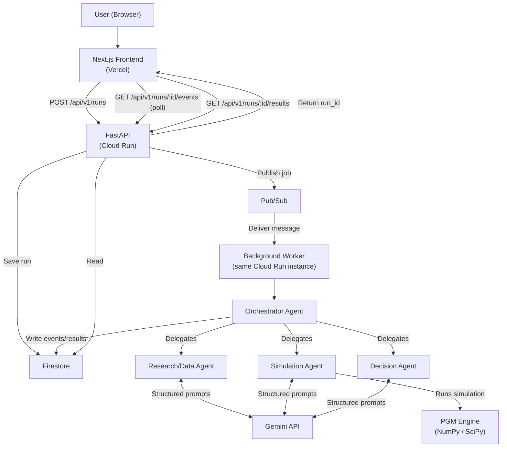

# Regulus — Architecture

## Overview

Regulus is a full-stack agentic system with three tiers:

1. **Frontend** — Next.js on Vercel, polls backend for run state and events
2. **Backend** — FastAPI on Cloud Run, exposes REST API, delegates work via Pub/Sub
3. **Worker** — same Cloud Run container, processes async jobs, runs agent workflow

---

## System diagram



---

## Data flow

### Creating a run

```
POST /api/v1/runs
  → Validate input (Pydantic)
  → Create Run document (status: QUEUED) in Firestore
  → Publish {run_id} to Pub/Sub topic
  → Return {run_id} to client immediately
```

### Processing a run

```
Worker receives Pub/Sub message
  → Fetch Run from Firestore
  → OrchestratorAgent.execute(run)
    → Transition: PLANNING
    → Gemini: analyze problem → ProblemDefinition
    → Transition: RESEARCHING
    → ResearchAgent.gather_evidence() → ResearchFindings
    → Save evidence to Firestore
    → Transition: MODELING
    → SimulationAgent.build_model(findings) → PGMGraph
    → Save model to Firestore
    → SimulationAgent.build_scenarios() → ScenarioSet
    → Save scenarios to Firestore
    → Transition: SIMULATING
    → SimulationAgent.run_simulation() → [ScenarioResult]
    → Transition: ANALYZING
    → SimulationAgent.run_sensitivity() → SensitivityResult
    ↓
    [Autonomous loop — repeats up to MAX_RESEARCH_LOOPS]
    If sensitivity.is_material:
      → Emit UNCERTAINTY_DETECTED event
      → Transition: RESEARCHING_AGAIN
      → ResearchAgent.gather_evidence(target=dominant_variable)
      → Rebuild PGM with merged evidence
      → Re-run simulation
      → Re-run sensitivity
    ↓
    → Transition: FINALIZING
    → DecisionAgent.generate_recommendation()
    → Save RunResult to Firestore
    → Transition: COMPLETED
```

### Frontend polling

```
Run page mounts
  → GET /api/v1/runs/:id  (every 2s while not terminal)
  → GET /api/v1/runs/:id/events  (every 2s while not terminal)
  → When completed: GET /api/v1/runs/:id/results
```

---

## Component breakdown

### Backend (`backend/app/`)

| Package | Responsibility |
|---|---|
| `domain/` | Pure Pydantic models, enums, state machine. No cloud dependencies. |
| `pgm/` | Graph construction, Monte Carlo simulation, sensitivity analysis. Pure Python/NumPy. |
| `agents/` | Four agent classes that combine Gemini reasoning with PGM computations. |
| `infrastructure/` | Firestore repositories, Pub/Sub clients, Gemini wrapper, logging config. |
| `workers/` | `RunWorker` — dequeues jobs, assembles agent graph, calls Orchestrator. |
| `api/` | Thin FastAPI routes + dependency injection. No business logic here. |

### Frontend (`frontend/`)

| Directory | Contents |
|---|---|
| `app/` | Next.js App Router pages |
| `app/app/new/` | Scenario submission form |
| `app/app/runs/[runId]/` | Run dashboard with live event timeline |
| `app/app/model/[runId]/` | PGM graph visualization (React Flow) |
| `app/app/results/[runId]/` | Final results report with charts |
| `components/run/` | EventTimeline, RunStatusBar |
| `components/model/` | PGMGraph (React Flow wrapper) |
| `lib/` | API client, types, validation, utilities |
| `hooks/` | TanStack Query hooks with polling logic |

---

## State machine

```
CREATED → QUEUED → PLANNING → RESEARCHING → MODELING → SIMULATING
  → ANALYZING → [RESEARCHING_AGAIN → MODELING → SIMULATING → ANALYZING]
  → FINALIZING → COMPLETED

Any state → FAILED (on unrecoverable error)
Most states → CANCELLED (on user request)
```

Invalid transitions are rejected with a `ValueError`.

---

## Firestore schema

```
runs/{runId}           — Run document (status, input, metadata)
events/{eventId}       — AgentEvent (run_id, agent, type, message, metadata)
models/{runId}         — Serialized PGM (nodes, edges, distributions)
scenarios/{runId}      — ScenarioSet (list of Scenario objects)
results/{runId}        — RunResult (ScenarioResults, Sensitivity, Recommendation)
evidence/{evidenceId}  — EvidenceItem (claim, value, confidence, source, run_id)
```

---

## Local development overrides

| Flag | Default in dev | Behavior |
|---|---|---|
| `USE_MOCK_RESEARCH=true` | true | Uses synthetic Maji Valley dataset, no Gemini calls for research |
| `USE_MOCK_FIRESTORE=false` | false | Uses in-memory repositories (set true to skip Firestore) |
| `USE_MOCK_PUBSUB=false` | false | Uses asyncio.Queue instead of real Pub/Sub |
| Gemini mock | Auto if no credentials | GeminiClient uses mock responses |

When `ENVIRONMENT=development` and no `GOOGLE_APPLICATION_CREDENTIALS` is set, the backend automatically activates mock mode for Gemini and in-memory storage.
