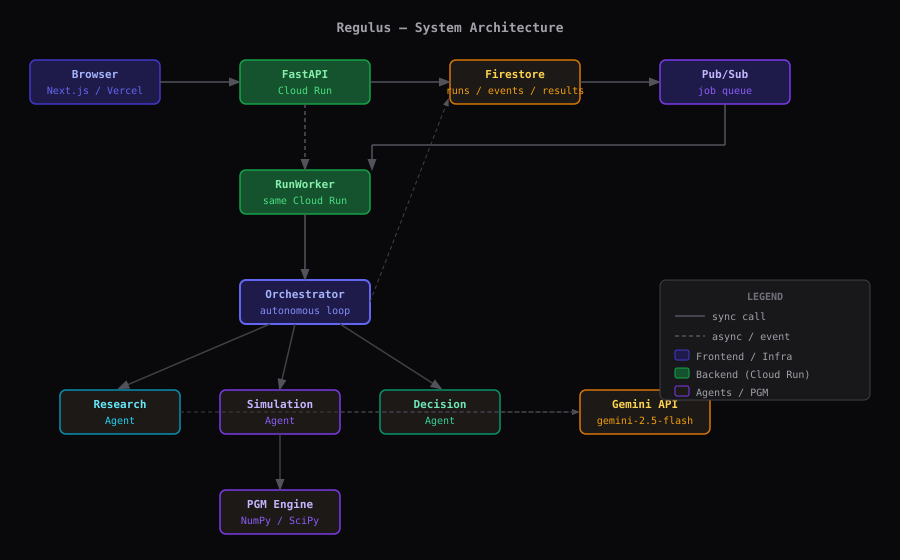

# Regulus

**Autonomous infrastructure decision laboratory.**

Regulus helps decision-makers explore difficult infrastructure problems under uncertainty. It uses autonomous Gemini agents and probabilistic simulation to research, model, simulate, and recommend — without a human manually orchestrating every step.

> **Built by a Burundian developer who has lived these infrastructure problems firsthand.**
>
> _Demo scenario: How should a local authority allocate $50,000 to improve reliable water access across three communities in Bujumbura's peri-urban zone — where the grid runs 10–14 hours a day and pump failures are routine?_

---

## The problem this solves

In Burundi — and across much of sub-Saharan Africa — infrastructure allocation decisions are made under deep uncertainty:

- The electricity grid is unreliable (10–16 hours/day in many areas)
- Rainfall is variable and seasonal
- Pump infrastructure is aging and maintenance is inconsistent
- Budget is scarce and mistakes are expensive

A local authority with $50,000 to spend on water infrastructure has to choose between pump expansion, solar pumping, storage tanks, or a combined approach — without knowing which variable will dominate outcomes.

Regulus was built to make that investigation rigorous and transparent.

---

## What makes this different from an AI chatbot

Regulus does not generate an answer. It performs an investigation:

1. **Decomposes** the decision problem into variables, constraints, and evidence requirements
2. **Researches** available evidence and classifies confidence for every finding
3. **Builds** a probabilistic graphical model from the evidence
4. **Simulates** intervention scenarios using Monte Carlo analysis
5. **Detects** dominant uncertainty via sensitivity analysis
6. **Decides autonomously** whether to investigate further — and loops if necessary
7. **Produces** a recommendation with explicit assumptions, risks, and uncertainty bounds

The loop from step 5 → 6 → 3 → 4 is the core agentic behavior.

---

## Quick start

### Backend

```bash
cd backend
python -m venv .venv && source .venv/bin/activate
pip install -r requirements.txt
cp .env.example .env       # edit as needed
uvicorn app.main:app --reload --port 8000
```

### Frontend

```bash
cd frontend
npm install
cp .env.local.example .env.local   # set NEXT_PUBLIC_API_BASE_URL=http://localhost:8000
npm run dev
```

Open [http://localhost:3000](http://localhost:3000) and click **Run demo scenario**.

---

## Architecture at a glance



```
Vercel (Next.js)  →  Cloud Run (FastAPI)  →  Pub/Sub  →  Worker
                                ↓                              ↓
                           Firestore  ←——————————————  Orchestrator Agent
                                                              ↓
                                              Research / Simulation / Decision
```

See [ARCHITECTURE.md](ARCHITECTURE.md) for the full diagram.

---

## Technology

| Layer | Stack |
|---|---|
| Frontend | Next.js 15, TypeScript, Tailwind CSS, Recharts, React Flow, TanStack Query |
| Backend | Python 3.12+, FastAPI, Pydantic, structlog |
| AI | Google Gemini 2.5 Flash (via google-genai SDK), 4 autonomous agents |
| Math | NumPy, SciPy, NetworkX, Monte Carlo simulation |
| Cloud | Google Cloud Run, Firestore, Pub/Sub |
| Tests | pytest, 52 tests, full integration test |

---

## Documentation

| File | Contents |
|---|---|
| [ARCHITECTURE.md](ARCHITECTURE.md) | System architecture, data flow, component diagram |
| [AGENTS.md](AGENTS.md) | Agent responsibilities, tools, prompts, failure handling |
| [PGM.md](PGM.md) | Probabilistic model, variables, simulation, sensitivity |
| [DEVELOPMENT.md](DEVELOPMENT.md) | Local dev setup, environment variables, running tests |
| [DEMO.md](DEMO.md) | Demo scenario walkthrough, expected outputs |
| [VERCEL_DEPLOYMENT.md](VERCEL_DEPLOYMENT.md) | Frontend deployment to Vercel |
| [CLOUD_RUN_DEPLOYMENT.md](CLOUD_RUN_DEPLOYMENT.md) | Backend deployment to Google Cloud Run |

---

## Disclaimer

The demonstration scenario uses illustrative data based on general infrastructure patterns in peri-urban East Africa. Values are not sourced from official government statistics. Results are probabilistic scenario estimates — not predictions, guarantees, or policy recommendations. Consult domain experts and local authorities before acting on any analysis.
